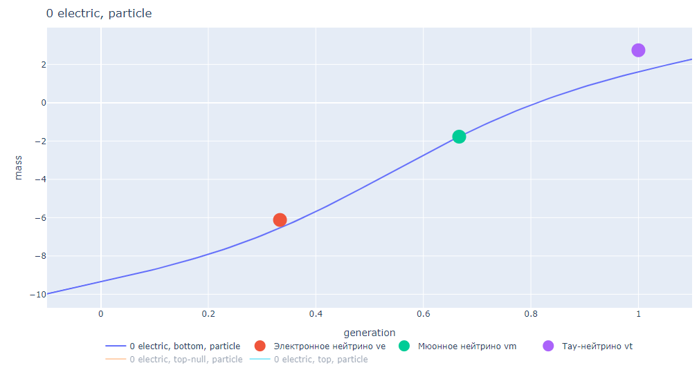

# Standart Model

## Название и цель исследования

Нейронная сеть, описывающая стандартную модель элементарных частиц. На основании базовых параметров частиц определяет их массу.

## Состав репозитория

- Elementary base.xlsx - Базовые параметры элементарных частиц + лучшая модель для их предсказания.

- Elementary selection.xlsx - Файл с параметрами + сравнение разных моделей.

- Elementary.csv - Датафрейм для обучения модели.

- StandartModel BaseTrain.ipynb - Обучение модели на существующих данных о 28 элементарных частицах.

- StandartModel Series.ipynb - Дообучение модели с учётом погрешности измерения массы элементарных частиц (колонка *"Допустимая погрешность (МэВ)"*).

- StandartModel Math.ipynb - Проведение некоторого математического анализа + дообучение модели:

  - Расчёт компонентов массы в зависимости от электического заряда
  - Анализ и объединение графиков
  - Симметрия частица/античастица: оценка погрешности модели, дообучение модели на основании симметрии.

- StandartModel Graph.ipynb - Графическое представление результатов моделирования:

  - Построение трёхмерных графиков в осях: *масса - электрический заряд - спин*

  - Построение трёхмерных суммарных графиков, несколько поверхностей на основании признака *"верх/низ"*

  - Плоские графики среза по значению *спин = 0.5*

  - Графики поколений
  
    

## Входные и выходные данные

На данный момент физика знает о 30 элементарных частицах, которые входят в стандартную модель. Для построения нашей модели используются данные о 28 элементарных частицах (частицы + античастицы). Сюда не входят данные о безмассовых частицах: глюон и фотон.

В качестве входных данных используются следующие показатели:

1. Поколение элементарной частицы (generation): 0/3 (бозоны); 1/3; 2/3; 3/3. Поколение частицы определяется номером столбца таблицы стандартной модели (см. ниже).
2. Признак верх/низ: -1 (низ - bottom); 0 (бозон Хиггса - top-null); +1 (верх - top). Этот признак определяется строкой таблицы стандартной модели (см. ниже).
3. Признак частица/античастица: -1 (античастица - antiparticle); 0 (совпадение - particle-null); +1 (частица - particle).
4. Спин (spin): значение от 0 до 1.
5. Электрический заряд (electric): значение от -1 до +1.

Выход - это логарифм массы элементарной частицы. Масса выражена здесь в МэВ (мега электрон-вольт).

   (1)

Входные данные и саму стандартную модель можно найти здесь: https://ru.wikipedia.org/wiki/%D0%A1%D1%82%D0%B0%D0%BD%D0%B4%D0%B0%D1%80%D1%82%D0%BD%D0%B0%D1%8F_%D0%BC%D0%BE%D0%B4%D0%B5%D0%BB%D1%8C

Значения массы и погрешность её измерения из файла *Elementary.csv* не брались из этой таблицы, а искались в других источниках и уточнялись.

## Обучение модели

1. Ноутбук *"StandartModel BaseTrain"* предназначен для первоначального создания и обучения модели по 28 элементарным частицам. В конце сохраняем нашу модель (модель #1).

   

2. Ноутбук *"StandartModel Series"* работает со снижением отдельных погрешностей массы элементарных частиц. Здесь работаем с колонкой *"Допустимая погрешность (МэВ)"*. В конце сохраняем нашу модель (модель #2).

   

3. С помощью ноутбука *"StandartModel Math"* оцениваем составляющие модели (по количеству скрытых нейронов - 6 составляющих). 

   

4. Анализируем что будет с моделью при объединении некоторых её составляющих.

5. Рассматриваем симметрию частица/античастица: оцениваем погрешность модели. На графике рассматриваем зависимость электрического заряда от массы. Далее, чтобы уменьшить эту ошибку, дообучаем модель на сгенерированных данных + заполняем предварительно соответствующие таблицы 13 частицами и 13 античастицами. В конце сохраняем нашу модель (модель #3).

   Погрешность до (*электрический заряд - масса*):

   

   Погрешность после (*электрический заряд - масса*):

   

6. Используем ноутбук *"StandartModel Series"* для повторного обучения модели, чтобы не было перекосов в погрешности конкретных элементарных частиц. Полученную модель сверяем с реальной погрешностью и сохраняем (модель #4). На выходе также получаем файл *pred.csv*, который будет полезен для анализа.

7. С помощью ноутбука *"StandartModel Graph"* анализируем модель графически.

   - Построение трёхмерных графиков в осях: *масса - электрический заряд - спин*

     

   - Построение трёхмерных суммарных графиков, несколько поверхностей на основании признака *"верх/низ"*

     

   - Плоские графики среза по значению *спин = 0.5*
   
     
     
     

## Логика построения модели

Детали построения нейронной сети:

- Модель представляет собой нейронную сеть: 5 входов, 1 выход, 1 или 2 скрытых слоя.
- В качестве функций активации рассматривались: tanh, sigmoid, relu, linear.
- В скрытом слое рассматривалось от 3 до 12 нейронов.
- В качестве выхода брались значения: массы, натурального логарифма от массы, sigmoid логарифма массы.

Логика построения модели заключается в том, чтобы используя простые параметры элементарных частиц, предсказать их массу с заданной погрешностью измерения. Что известно о элементарных частицах для построения модели? Используем следующие утверждения:

1. Как известно, погрешность измерения массы разная для различных элементарных частиц. Наиболее точная масса определена для электрона/позитрона.
2. Симметричные частицы (частица/античастица) имеют противоположный электрический заряд и одинаковую массу покоя.

Процесс построения модели был такой:

- Модель обучается на данных о 28 частицах. Находим оптимальную структуру модели.

- Также учитывается погрешность измерения массы частиц, чтобы предсказанные значения полностью укладывались в существующую погрешность измерения. Для этого модель периодически обучается на тех частицах, которые выходят за допустимые пределы массы.
- Рассматриваем симметрию частица/античастица: оцениваем погрешность модели. Затем случайным образом генерируем  входные данные несуществующих частиц. С помощью существующей модели предсказываем массы этих частиц. Главное - это чтобы сгенерированные частицы были симметричными относительно друг друга. Массы симметричных частиц усредняем. На сгенерированных данных затем также обучаем нашу модель, чтобы её сбалансировать для обеспечения симметрии.
- Ещё раз дообучаем модель для минимизации расхождения с оригинальной массой существующих элементарных частиц.
- Анализируем графики, формализуем выводы.

## Выводы и предположения

В ходе экспериментов стало ясно, что оптимальной является модель нейронной сети, которая: 

- Содержит 1 скрытый слой.
- Содержит 6 нейронов в скрытом слое.
- В качестве функции активации используются sigmoid в скрытом слое и linear в выходном слое.
- В качестве выходного значения берётся логарифм от массы (измеренное в МэВ) элементарной частицы.

Математически модель может быть описана так:

   (2)

   (3)

Где:

- *W1, W2, B1, B2* -- матрицы/векторы весовых коэффициентов
- *X* -- входные данные (5 входов)
- *y* -- логарифм массы элементарной частицы
- *mass* -- масса элементарной частицы в МэВ.

Хотя обучающих данных не так много (всего 28 частиц), модель получилась довольно логичной. С помощью обученной модели стали прослеживаться некоторые зависимости. Тем более в обучении мы использовали не только реальные частицы, но и сгенерированные по определённой закономерности. Впоследствии можно усовершенствовать и дообучить модель, используя другие группы симметрии или закономерности стандартной модели, что позволит несколько конкретизировать веса у существующей нейросети.

В ходе анализа модельных графиков удалось разглядеть некоторые закономерности и правила. Попробуем сформулировать эти выводы:

1. Вдоль нулевого электрического заряда тянется либо горб (top), либо впадина (bottom) логарифмической массы (либо то и другое с переходом).

2. С увеличением спина логарифмическая масса постепенно снижается.

3. При прочих равных условиях 3D поверхность *масса - электрический заряд - спин* более-менее симметрична относительно около нулевого заряда.

4. "Лепестки" поверхности top всегда несколько ниже "лепестков" поверхности bottom (3D поверхность *масса - электрический заряд - спин*).

5. Попробуем взять частицу, которая не участвовала в обучении и предсказать массу для неё. Для фотона берём поверхность *"0 generation, bottom, particle-null"*. Видим, что для безмассовой частицы масса стремиться к нулю, что верно предсказала модель.

   

6. Попробуем предсказать массу глюона. Для этого возьмём поверхность *"0 generation, top, particle-null"*. Тут масса ненулевая, т.к. на этой же поверхности находится Z-бозон. Тогда можно предположить, что глюоны разделяются на частицу и античастицу. И тут действительно в теории есть 8 глюонов, которые разделяются по цветному заряду.

   

   Берём тогда поверхности *"0 generation, top, particle"* и *"0 generation, top, antiparticle"*. Но глюон всё равно находится на выпуклой поверхности, масса его здесь около 15377 МэВ. На этот раз прогноз не оправдался, но зато возник прецедент для дальнейшего исследования/уточнения модели.

   Для глюона больше подходит отнесение его к классу частиц top-null (признак верх/низ = 0). Но в этом случае будет нарушена симметрия top/bottom.

   

7. Если смотреть на составляющие модели, можно заметить, что 2 основных нелинейных графика формируют несимметричные склоны. Это означает, что один склон более пологий, чем другой. Причём такая несимметричность проявляется в разную сторону в зависимости от признака *top/bottom*. Также сформированные пики всегда оказываются либо справа, либо слева от нулевого электрического заряда.

   

   

   

8. Комбинация спина = 1, электрического заряда = 0 и положения частицы в bottom даёт ей около нулевую массу (нейтрино).

9. Если анализировать зависимость логарифмической массы от поколения частицы, то между 1 и 3 поколениями наблюдается почти линейная зависимость между реальными частицами.

   

   

   

